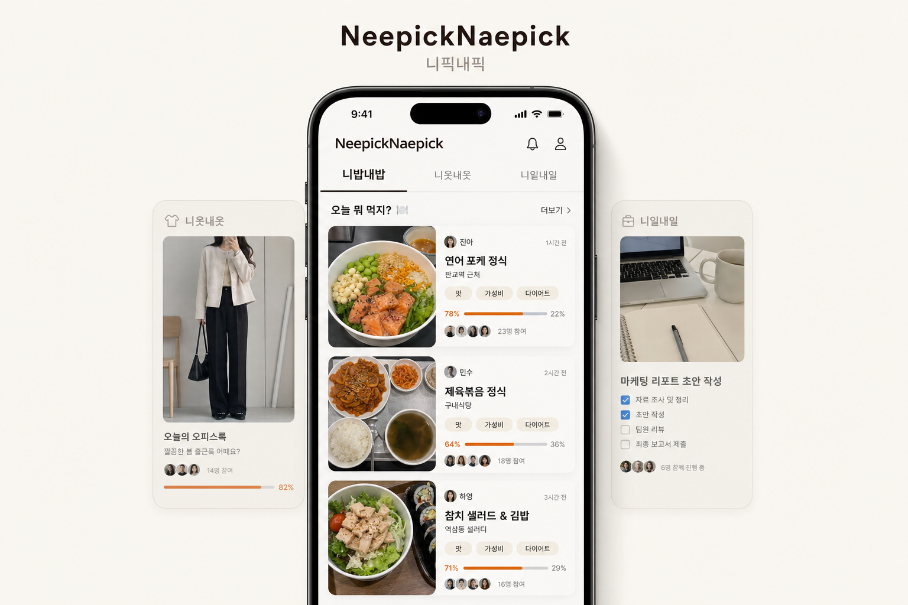

# NeepickNaepick



**NeepickNaepick(니픽내픽)**은 친구끼리 각자의 선택지를 올리고, 정해진 기준으로 비교한 뒤, 필요하면 커뮤니티 판정까지 받아 승자를 고르는 소셜 배틀 앱입니다.

서비스는 여러 카테고리로 확장되지만, 첫 번째 핵심 경험은 **니밥내밥**입니다. 매일 점심시간마다 친구 그룹에 자동으로 배틀이 열리고, 같이하기로 한 친구들이 각자 먹은 밥 사진을 올려 오늘의 승자를 고릅니다.

## 니밥내밥: daily lunch battle

니밥내밥은 “오늘 누가 더 잘 먹었나?”를 세 가지 기준으로 판정합니다.

- **맛:** 보기만 해도 먹고 싶은 메뉴인지
- **가성비:** 가격 대비 만족도가 좋아 보이는지
- **다이어트:** 부담 없이 먹기 좋은 선택인지

친구들은 각 기준별로 투표하고, 앱은 기준별 결과와 종합 승자를 보여줍니다. 친구끼리 결과가 갈리거나 더 많은 의견이 필요하면 커뮤니티 투표로 넘겨 외부 판정을 받을 수 있습니다.

## Daily lunch loop

1. 점심시간이 되면 친구 그룹에 오늘의 니밥내밥이 자동으로 열립니다.
2. 같이하기로 한 친구들이 각자 먹은 밥 사진과 간단한 메모를 올립니다.
3. 친구끼리 맛, 가성비, 다이어트 기준으로 투표합니다.
4. 기준별 점수와 종합 승자가 정리됩니다.
5. 필요하면 커뮤니티에 공개해 남들이 승자를 정해줍니다.

## Service categories

NeepickNaepick은 니밥내밥의 구조를 다른 일상 선택으로 확장합니다.

- **니밥내밥:** 점심 사진을 올리고 맛, 가성비, 다이어트로 승자를 고르는 대표 카테고리
- **니옷내옷:** 오늘의 옷차림이나 구매 후보를 올리고 핏, 활용도, 가격감으로 비교하는 카테고리
- **니일내일:** 할 일, 공부, 업무 루틴, 생산성 선택지를 올리고 효율, 난이도, 지속가능성으로 비교하는 카테고리

핵심은 같습니다. 가까운 친구들이 먼저 올리고, 먼저 고르고, 필요할 때 커뮤니티가 판정합니다.

## App preview

현재 스캐폴드는 실제 발표와 프로토타입 확인을 위한 웹/모바일/백엔드 구조를 포함합니다. 발표 흐름은 니밥내밥을 중심으로 보여주되, 상위 서비스는 NeepickNaepick으로 유지합니다.

- **Daily Battle:** 점심시간에 자동으로 열리는 친구 그룹별 업로드 화면
- **Friend Vote:** 맛, 가성비, 다이어트 기준으로 친구끼리 승자를 고르는 화면
- **Community Judge:** 친구끼리 결론이 안 날 때 외부 투표로 승자를 정하는 화면
- **Category Expansion:** 니옷내옷, 니일내일로 확장되는 동일한 배틀 구조

## Apps

- `neepicknaepick-mobile`: Bare React Native + TypeScript mobile app.
- `neepicknaepick-be`: FastAPI backend.
- `neepicknaepick-web`: React web frontend for landing, app preview, share/fallback pages.

## Local services

```bash
docker compose up -d postgres minio
```

- Postgres: `localhost:5432`
- MinIO S3 API: `localhost:9000`
- MinIO console: `localhost:9001`

## Backend

```bash
cd neepicknaepick-be
uv sync
uv run pytest
uv run uvicorn app.main:app --reload
```

## Web

```bash
cd neepicknaepick-web
npm install
npm run dev
```

## Mobile

The mobile package is intentionally bare React Native-oriented, not WebView/Capacitor.

```bash
cd neepicknaepick-mobile
npm install
npm run start
```
